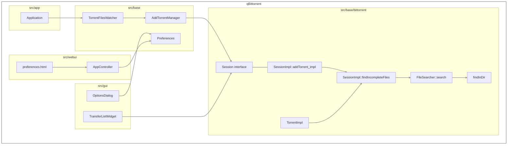
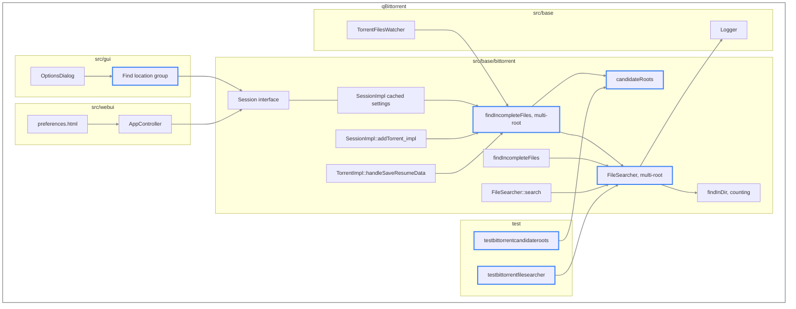
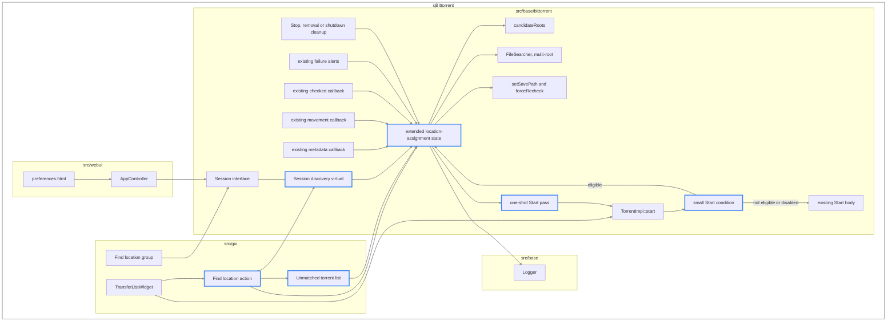
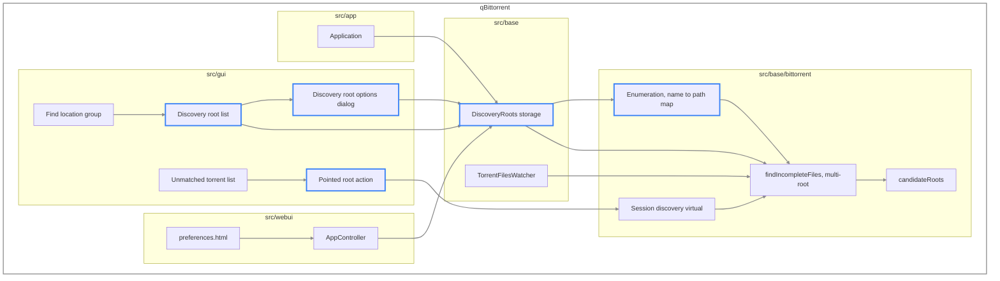

# Find Location — System Architecture

The systems this feature touches, and the shape of the repository after each submission. Behaviour is set out in [the feature specification](find-location_feature_spec.md), requirements in [the product requirements](find-location_product_requirements.md), implementation in [the technical approach](find-location_technical_approach.md), qualities in [the non-functional requirements](find-location_nfr.md), and build order in [the dependency map](find-location_dependency_map.md).

## Systems touched

| System | Location | Role |
| --- | --- | --- |
| Search | `src/base/bittorrent/filesearcher.*` | Probes a directory for a torrent's files, and constructs the candidate root list from the inputs its callers supply |
| Session implementation | `src/base/bittorrent/sessionimpl.*` | Composes searches, extends the existing location-assignment state with pending Start intent, and marshals searching onto the I/O thread |
| Session interface | `src/base/bittorrent/session.h` | The abstraction `src/gui` and `src/webui` hold |
| Torrent | `src/base/bittorrent/torrentimpl.*` | Adds a small conditional delegation before Start can allocate or request payload, while retaining the existing Start, Stop, metadata and recheck implementations |
| Settings | `src/base/bittorrent/sessionimpl.*` | Holds the cached Find Location settings under the BitTorrent session keys |
| Discovery roots | `src/base/` | Holds the user's search roots and their per-root options |
| Watched folders | `src/base/torrentfileswatcher.*` | Supplies save paths to the search, and models per-root storage |
| Logging | `src/base/logger.h` | Records what discovery chose |
| Application | `src/app/application.cpp` | Owns the lifecycle of the discovery root singleton |
| Desktop interface | `src/gui/` | The options group, the transfer list action, and the dialogs |
| WebAPI | `src/webui/api/appcontroller.cpp`, `src/webui/webapplication.h` | Exposes the settings and versions the API |
| Web interface | `src/webui/www/private/views/preferences.html` | Presents the settings to a WebUI user |
| Build | `src/base/CMakeLists.txt`, `src/gui/CMakeLists.txt`, `test/CMakeLists.txt` | Registers every new source file |
| Tests | `test/`, `test/testdata/` | Covers the pure functions and the probe; existing-torrent lifecycle behavior is covered at the Epic 2 integration boundary without a new test-only session architecture |

## Baseline

The resolution path before any of this work.

`FileSearcher` probes the torrent's save path, then its download path. `SessionImpl::addTorrent_impl` takes the result before libtorrent receives the torrent; `TorrentImpl` takes it when a magnet link's metadata arrives.

## Epic 1 — automatic discovery

**Added.** `candidateRoots()` beside `FileSearcher`. A multi-root search method, with `search()` delegating to it. A sibling to `findIncompleteFiles()` taking the root list. Two boolean settings. The options dialog group. The WebAPI keys and the WebUI controls that present them. Two test executables.

**Changed.** `findInDir()` returns a count. `addTorrent_impl` and `TorrentImpl` pass root lists rather than two paths.

**Unchanged.** Every signature outside `filesearcher.cpp` that a caller already depends on.

## Epic 2 — Start-triggered, manual, batch and assignment

**Added.** A discovery virtual on the session interface with a completion signal. Four boolean settings, including **Find location when starting stopped torrents**. The existing `SessionImpl` location-assignment map gains enough state to remember a held Start and advance it through the session callbacks that already exist. The transfer list action and the dialog listing torrents that matched nothing are also added.

**Changed.** `TorrentImpl::start()` gains one early conditional call into `SessionImpl`, after its existing error-clearing preamble but before the missing-files reload or any resume. The ordinary Start body stays in place. Existing session callbacks gain guarded lookups into the feature state. The options dialog group and the WebAPI gain the four settings, and the WebUI preferences page gains their controls.

**Unchanged.** Everything Epic 1 built below the session interface. The normal Start path, move-storage queue, metadata pipeline, force-recheck implementation, libtorrent alert routing, and unrelated check and error handling retain their current behavior. When either Find Location gate is disabled, the new Start condition is false and execution follows the existing body unchanged.

### Minimal ownership and existing event hooks

`SessionImpl` owns the small amount of feature state because it already owns the torrent registry, cached Find Location settings, search composition, and the existing assignment map. The map is extended rather than replaced by a general transaction framework. A pending Start entry carries its phase, target location when one exists, original `TorrentOperatingMode`, and a token that makes a late search result harmless after cancellation or replacement.

No new torrent lifecycle notification layer is introduced. `SessionImpl` advances the entry only from callbacks it already receives. When it must use the existing Start path, it arms a one-shot pass on that entry and calls the public `Torrent::start(mode)`. The early Start condition consumes the pass and returns false, allowing the unchanged Start body to run once without starting another search. A terminal pass removes the entry; the metadata-only pass retains it in waiting-for-metadata.

| Event | Existing or added hook | Transaction advance |
| --- | --- | --- |
| Start requested | One conditional delegation from `TorrentImpl::start(mode)` after its existing error-clearing preamble and before missing-files reload or resume | An eligible stopped, manual-mode torrent enters search or waits for metadata. A repeated Start updates/coalesces into the same entry. Disabled, ineligible and one-shot release calls fall through to the unchanged Start body. |
| Metadata becomes usable | Existing `SessionImpl::handleTorrentMetadataReceived()` and `handleTorrentInfoHashChanged()` | If metadata changes the `TorrentID`, the entry is re-keyed. Once the existing metadata pipeline has produced a usable file list, a waiting entry begins discovery; no new metadata callback is added. |
| Search completes | The existing asynchronous `searchExistingContent()` continuation returns to `SessionImpl` | A miss arms a terminal one-shot Start pass. A match records the target; an own-path match goes directly to recheck, while a different-path match uses the existing assignment and movement operations. |
| Storage settles | `SessionImpl::handleTorrentStorageMovingStateChanged()` | A transaction waiting for movement advances only after no move is pending and `actualStorageLocation()` equals its target; it then issues the feature recheck. A different final location is failure. |
| Check completes | Existing `SessionImpl::handleTorrentChecked()` | Only an entry already waiting for the feature-issued check may enter one-shot release. Every unrelated check keeps its existing behavior. |
| Search, metadata preparation, storage or file I/O fails | Existing search continuation, `handleSaveResumeDataFailedAlert()`, `handleStorageMovedFailedAlert()`, and `handleFileErrorAlert()` | After existing logging and error handling, a matching feature entry is cleared and its pending Start is discarded. The torrent is stopped. The feature never treats cached **Checking** as success. |
| Stop, removal or shutdown | A narrowly scoped Stop-request cancellation point, existing `removeTorrent()`, and session teardown | Feature state is invalidated so a late continuation cannot resume the torrent. The current internal stop-after-check path is explicitly excluded from user cancellation without changing its behavior. |

The feature works around the known force-recheck failure without repairing the general recheck implementation. Because the Start hook follows the existing error-clearing preamble, a later Start clears the stale native error before discovery and a new feature recheck. If the feature-issued recheck reports an I/O error, the existing error alert path clears the feature entry, discards Start intent, and stops the torrent so `StopCondition::FilesChecked` cannot retain a live feature transaction. Repairing force recheck for operations outside Find Location remains separate follow-up work.

The hold remains in force until a successful miss or successful completion of the feature-issued recheck. Assignment, movement completion alone, cached **Checking**, and unrelated check alerts do not release it.

## Epic 3 — discovery roots

**Added.** Discovery root storage with per-root options, persisted as JSON. Enumeration producing a name-to-path map. The discovery root list in the options dialog and its per-root dialog. The pointed root action on the unmatched list. The singleton's lifecycle in `Application`.

**Changed.** The session search sibling reads the discovery root list and places those roots ahead of the watched folder save paths in the list it composes. `candidateRoots()` takes the enumerated map. The WebAPI and the WebUI preferences page gain the root list.

**Unchanged.** The probing, scoring and resolution built in Epic 1.

## Requirements trace

Specification behaviour against the architecture that carries it.

| Requirement | Carried by | Epic |
| --- | --- | --- |
| Place a torrent at content already on disk | `candidateRoots`, multi-root `FileSearcher`, `resolveFileNames` | 1 |
| Resolve before pieces are requested | `addTorrent_impl` ahead of libtorrent | 1 |
| Resolve for magnet links | `TorrentImpl::handleSaveResumeData` | 1 |
| Recover partial content | `findInDir` matching through `QB_EXT` | 1 |
| Any recoverable content is kept, at any proportion | `resolveFileNames`, `handleTorrentChecked` | 1, 2 |
| Probe by count, abandon early | `findInDir` counting variant | 1 |
| Select by count, order breaking ties | Multi-root `FileSearcher` | 1 |
| A miss goes to the configured destination | Multi-root `FileSearcher` | 1 |
| Enable and disable as a whole | Group gate preference, options group | 1 |
| Record what discovery chose | `Logger::addMessage` from the search | 1 |
| Settings reachable from the WebUI | `AppController`, `preferences.html` | 1, 2, 3 |
| Manual trigger, single and batch | Session discovery virtual, transfer list action | 2 |
| Torrents matching nothing are listed | Unmatched torrent list | 2 |
| Start is intercepted before allocation or payload transfer | one conditional in `TorrentImpl::start`, extended assignment state in `SessionImpl` | 2 |
| Start waits asynchronously for metadata and discovery | Existing metadata callback, search continuation, extended assignment state | 2 |
| A matching location is assigned and successfully rechecked before Start | movement hook, `forceRecheck`, checked hook | 2 |
| A successful miss releases the configured destination without assignment | search continuation, terminal one-shot Start pass | 2 |
| Original normal or forced Start intent is preserved | pending Start state, existing `Torrent::start` body | 2 |
| Repeated Start requests coalesce | assignment-map entry and operation token | 2 |
| Stop, removal, shutdown and failures cannot later resume the torrent | cancellation/error hooks, transaction cleanup | 2 |
| Assignment rechecks and returns to service | `setSavePath`, `forceRecheck`, `handleTorrentChecked` | 2 |
| Assignment leaves content at the assigned location intact | `setSavePath` under the transfer list action | 2 |
| Seeding and downloading separately controlled | Three assignment preferences | 2 |
| Explicit Start preserves its requested operating mode; automatic assignment respects the queue | one-shot Start pass; existing `Torrent::start` behavior | 2 |
| Search directories the user configures | Discovery root storage, `candidateRoots` ordering | 3 |
| Recursive roots listed once and matched by name | Enumeration | 3 |
| Point the unmatched list at a directory | Pointed root action | 3 |
| A pointed root outranks every other search root | Session root composition | 3 |
| Repeatable across several disks | Pointed root action against the shrinking list | 3 |

## Build registration

Every new source file is registered where the repository already lists them: `src/base/CMakeLists.txt` for discovery root storage, `src/gui/CMakeLists.txt` for the unmatched list, the discovery root list and its options dialog, and `test/CMakeLists.txt` for both test executables.
