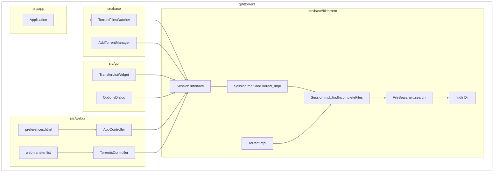
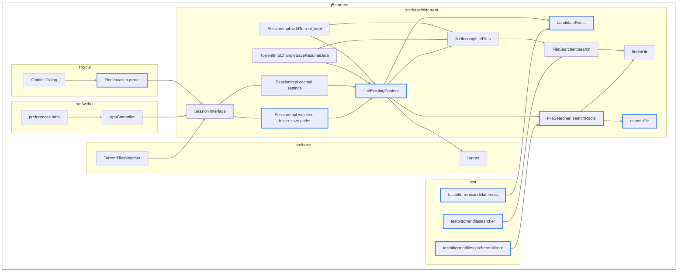
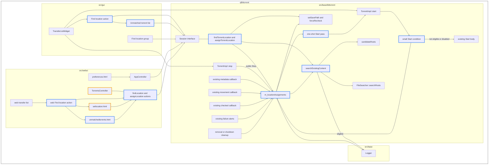
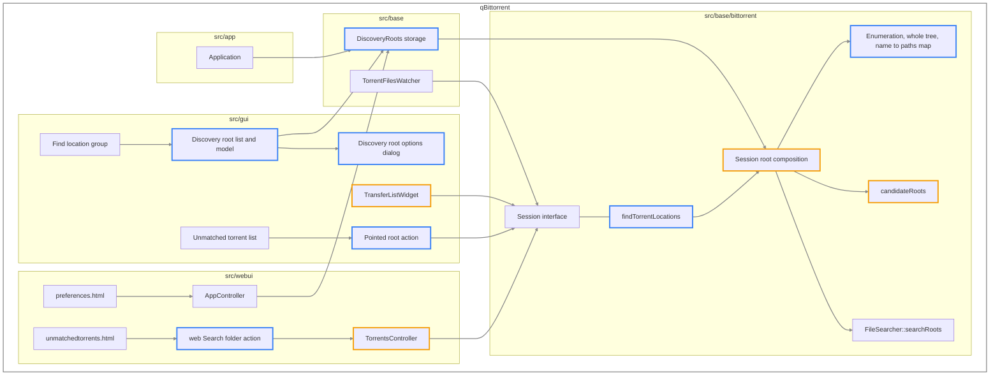

# Find Location — System Architecture

The systems this feature touches, and the shape of the repository after each submission. Behaviour is set out in [the feature specification](find-location_feature_spec.md), requirements in [the product requirements](find-location_product_requirements.md), implementation in [the technical approach](find-location_technical_approach.md), qualities in [the non-functional requirements](find-location_nfr.md), build order in [the dependency map](find-location_dependency_map.md), and files, tests and verification in [the workplan](find-location_workplan.md).

## Systems touched

| System | Location | Role |
| --- | --- | --- |
| Search | `src/base/bittorrent/filesearcher.*` | Probes directories for a torrent's files, scores the torrent's own paths together with the candidates, constructs the candidate list from the inputs its callers supply, and walks every directory beneath a root for enumeration |
| Session implementation | `src/base/bittorrent/sessionimpl.*` | Holds the watched folder save paths pushed to it, composes searches, marshals searching onto the I/O thread, performs manual assignment, holds pending Start state in `m_locationAssignments`, and runs batch search operations |
| Session interface | `src/base/bittorrent/session.h` | The abstraction `src/gui`, `src/webui` and `TorrentFilesWatcher` hold, gaining `setWatchedFolderSavePaths()`, `findTorrentLocation()`, `assignTorrentLocation()`, `torrentLocationFound` and `findTorrentLocations()` |
| Torrent | `src/base/bittorrent/torrentimpl.*` | Resolves a manual-mode torrent's location when metadata arrives, clearing its download path when content is adopted, and adds one conditional Start delegation and the private `stop(bool)` overload while retaining the existing Start, Stop, metadata and recheck implementations |
| Settings | `src/base/bittorrent/sessionimpl.*` | Holds the cached Find Location settings under the BitTorrent session `FindLocation/` keys |
| Discovery roots | `src/base/discoveryroots.*` | Holds the user's search roots and their per-root options, persisted to `discovery_roots.json` |
| Watched folders | `src/base/torrentfileswatcher.*` | Pushes the configured save path of every watched folder through `Session::setWatchedFolderSavePaths()`, and is the pattern discovery root storage follows |
| Logging | `src/base/logger.h` | Records discovery outcomes and Start transaction outcomes, written from `SessionImpl` |
| Application | `src/app/application.cpp` | Creates the discovery root singleton before the session and frees it after |
| Desktop interface | `src/gui/` | `optionsdialog`, `transferlistwidget`, `unmatchedtorrentsdialog`, `discoveryrootsmodel` and `discoveryrootoptionsdialog` |
| WebAPI | `src/webui/api/appcontroller.cpp`, `src/webui/api/torrentscontroller.*`, `src/webui/webapplication.h` | Exposes the settings on `app/preferences` and `app/setPreferences`, and runs discovery and assignment for a web session through `torrents/findLocation` and `torrents/assignLocation` |
| Web interface | `src/webui/www/private/views/preferences.html`, `src/webui/www/private/index.html`, `src/webui/www/private/views/transferlist.html`, `src/webui/www/private/scripts/contextmenu.js`, `src/webui/www/private/scripts/mocha-init.js`, `src/webui/www/private/setlocation.html`, `src/webui/www/private/unmatchedtorrents.html` | Presents the settings, the **Find location** context menu action and the list of torrents that matched nothing to a WebUI user |
| Build | `src/base/CMakeLists.txt`, `src/gui/CMakeLists.txt`, `test/CMakeLists.txt`, `src/webui/www/webui.qrc` | Registers every new source file and web interface page |
| Tests | `test/`, `test/testdata/` | Covers the pure functions, the probe and the enumeration; existing-torrent lifecycle behaviour is covered at the Epic 2 integration boundary without a new test-only session architecture |

## Baseline

The resolution path before any of this work.

`FileSearcher` probes the torrent's save path, then its download path. `SessionImpl::addTorrent_impl` takes the result before libtorrent receives the torrent; `TorrentImpl` takes it when a magnet link's metadata arrives.

## Epic 1 — automatic discovery

**Added.** `countInDir()` beside `findInDir()`. `FileSearcher::searchRoots()` and `SearchRootsResult` beside `search()`. `candidateRoots()` beside `FileSearcher`. `Session::setWatchedFolderSavePaths()`, pushed by `TorrentFilesWatcher::updateSessionWatchedFolderSavePaths()`. `SessionImpl::findExistingContent()`, a sibling to `findIncompleteFiles()` that composes the search roots itself and logs the outcome. Two boolean settings. The options dialog group. The WebAPI keys and the WebUI controls that present them. Three test executables and their fixtures.

**Changed.** A manual-mode torrent resolves through `findExistingContent()` at add and at metadata receipt; a torrent adopted at a candidate takes that location as its save path with an empty download path. An automatic-mode torrent resolves through `findIncompleteFiles()` as before.

**Unchanged.** `search()`, `findInDir()` and `findIncompleteFiles()`, in signature and behaviour, and every other signature a caller already depends on.

## Epic 2 — Start-triggered, manual, batch and assignment

**Added.** `Session::findTorrentLocation()`, `Session::assignTorrentLocation()` and the `torrentLocationFound` signal. Four boolean settings, including **Find location when starting stopped torrents**. `SessionImpl::searchExistingContent()`, the composition every call site reaches. `m_locationAssignments`, holding the state needed to hold, advance and release a pending Start through the session callbacks that already exist. The `interceptFindLocationStart()` and `cancelFindLocationStart()` hooks and the private `TorrentImpl::stop(bool)` overload. The transfer list action and the dialog listing torrents that matched nothing. The `torrents/findLocation` and `torrents/assignLocation` WebAPI actions, with the per-web-session operation map behind the first. The web interface **Find location** action and the `unmatchedtorrents.html` window listing torrents that matched nothing.

**Changed.** `TorrentImpl::start()` gains one early conditional call into `SessionImpl`, after its existing error-clearing preamble but before the missing-files reload or any resume. The ordinary Start body stays in place. Public `stop()` calls `stop(true)`, and the stop-after-check call uses `stop(false)`. Existing session callbacks gain guarded lookups into the feature state. `findExistingContent()` delegates its enabled branch to `searchExistingContent()`. The options dialog group and the WebAPI gain the four settings, and the WebUI preferences page gains their controls. `TorrentsController` connects to `torrentLocationFound`, and `WebApplication::m_allowedMethod` registers its two actions as POST-only. The web interface context menu gains **Find location**, and `setlocation.html` assigns through `torrents/assignLocation` when opened for a torrent that matched nothing.

**Unchanged.** The behaviour Epic 1 built below the session interface. The normal Start path, move-storage queue, metadata pipeline, force-recheck implementation, libtorrent alert routing, and unrelated check and error handling retain their current behaviour. When either Find Location gate is disabled, the new Start condition is false and execution follows the existing body unchanged.

### Minimal ownership and existing event hooks

`SessionImpl` owns the small amount of feature state because it already owns the torrent registry, cached Find Location settings and search composition. One map, `m_locationAssignments`, keyed by `TorrentID`, holds each entry's phase, target location when one exists, original `TorrentOperatingMode`, one-shot Start pass, and a token that makes a late search result harmless after cancellation or replacement. Manual assignment and pending Start share it.

No new torrent lifecycle notification layer is introduced. `SessionImpl` advances the entry only from callbacks it already receives. When it must use the existing Start path, it arms a one-shot pass on that entry and calls the public `Torrent::start(mode)`. The early Start condition consumes the pass and returns false, allowing the unchanged Start body to run once without starting another search. A terminal pass removes the entry; the metadata-only pass retains it in waiting-for-metadata.

| Event | Existing or added hook | Transaction advance |
| --- | --- | --- |
| Start requested | One conditional delegation from `TorrentImpl::start(mode)` after its existing error-clearing preamble and before missing-files reload or resume | An eligible stopped, manual-mode torrent that is not checking enters search or waits for metadata. A repeated Start updates/coalesces into the same entry. Disabled, ineligible and one-shot release calls fall through to the unchanged Start body. |
| Metadata becomes usable | Existing `SessionImpl::handleTorrentMetadataReceived()` and `handleTorrentInfoHashChanged()` | If metadata changes the `TorrentID`, the entry is re-keyed. Once the existing metadata pipeline has produced a usable file list, a waiting entry begins discovery; no new metadata callback is added. |
| Search completes | The `searchExistingContent()` continuation returns to `SessionImpl` | A miss arms a terminal one-shot Start pass. A match records the target; an own-path match goes directly to recheck, while a different-path match uses the existing assignment and movement operations. |
| Storage settles | `SessionImpl::handleTorrentStorageMovingStateChanged()` | A transaction waiting for movement advances only after no move is pending and `actualStorageLocation()` equals its target; it then issues the feature recheck. A different final location is failure. |
| Check completes | Existing `SessionImpl::handleTorrentChecked()` | Only an entry already waiting for the feature-issued check advances. With a pending Start it enters one-shot release. Without one, the torrent starts in auto-managed mode when **Seed automatically** holds for complete content or **Leech automatically** for incomplete content, and otherwise stays stopped. Every unrelated check keeps its existing behaviour. |
| Search, metadata preparation, storage or file I/O fails | The search continuation's failure handler, `handleSaveResumeDataFailedAlert()`, `handleStorageMovedFailedAlert()`, and `handleFileErrorAlert()` | After existing logging and error handling, a matching feature entry is cleared and its pending Start is discarded. The torrent is stopped. The feature never treats cached **Checking** as success. |
| Stop, removal or shutdown | Public `TorrentImpl::stop()` calling `stop(true)`, existing `removeTorrent()`, and session teardown | Feature state is invalidated so a late continuation cannot resume the torrent. The stop-after-check call uses `stop(false)` and does not cancel. |

The feature works around the known force-recheck failure without repairing the general recheck implementation. Because the Start hook follows the existing error-clearing preamble, a later Start clears the stale native error before discovery and a new feature recheck. If the feature-issued recheck reports an I/O error, the existing error alert path clears the feature entry, discards Start intent, and stops the torrent so `StopCondition::FilesChecked` cannot retain a live feature transaction. Repairing force recheck for operations outside Find Location remains separate follow-up work.

The hold remains in force until a successful miss or successful completion of the feature-issued recheck. Assignment, movement completion alone, cached **Checking**, and unrelated check alerts do not release it.

## Epic 3 — discovery roots

**Added.** Discovery root storage with per-root options, persisted to `discovery_roots.json` as a JSON array of objects carrying `path` and `recursive`. Enumeration walking every directory beneath a root, at any depth and without following links or junctions, into a map from name to every directory bearing it. `Session::findTorrentLocations()`, a batch operation taking torrent IDs and an optional pointed root. `SessionImpl::SearchOperation`, sharing one operation's roots and maps across its searches. The discovery root list in the options dialog, its model and its per-root dialog. The pointed root action on the unmatched list, in the desktop interface and in `unmatchedtorrents.html`, and the `root` parameter of `torrents/findLocation`. The singleton's lifecycle in `Application`. The `testdiscoveryroots` and `testbittorrentsubdirectories` test executables.

**Changed.** Session root composition places the pointed root first, then the discovery roots in configured order, then the watched folder save paths; it lists the pointed root and every recursive discovery root once per operation, and an automatic addition reuses an unchanged add operation still in flight. The log names the exact root whose candidates contain the winning location. `candidateRoots()` takes the enumerated maps, and each directory a map holds under the torrent's name or source name contributes its parent then itself. `findTorrentLocation()` runs as a one-torrent batch, and the transfer list and `torrents/findLocation` each submit an invocation's new torrents through one `findTorrentLocations()` call. The WebAPI and the WebUI preferences page gain the root list.

**Unchanged.** The probing, scoring and resolution built in Epic 1.

## Requirements trace

Specification behaviour against the architecture that carries it.

| Requirement | Carried by | Epic |
| --- | --- | --- |
| Place a torrent at content already on disk | `candidateRoots`, `FileSearcher::searchRoots`, `findExistingContent`, `resolveFileNames`, `handleSaveResumeData` | 1 |
| Resolve before pieces are requested | `addTorrent_impl` ahead of libtorrent | 1 |
| Resolve for magnet links | `TorrentImpl::handleSaveResumeData` | 1 |
| Recover partial content | `countInDir` and `findInDir` matching through `QB_EXT` | 1 |
| Any recoverable content is kept, at any proportion | `resolveFileNames`, `handleTorrentChecked` | 1, 2 |
| An adopted torrent moves nothing | Adoption with an empty download path in `addTorrent_impl` and `handleSaveResumeData` | 1 |
| Probe by count, abandon early | `countInDir` | 1 |
| Select by count, order breaking ties | `FileSearcher::searchRoots`, the own paths winning ties | 1 |
| A miss goes to the configured destination | `FileSearcher::searchRoots` | 1 |
| Enable and disable as a whole | Group gate setting, options group | 1 |
| Record what discovery chose | `findExistingContent` and `searchExistingContent` continuations through `Logger::addMessage` | 1 |
| Settings reachable from the WebUI | `AppController`, `preferences.html` | 1, 2, 3 |
| Manual trigger, single and batch | `Session::findTorrentLocation`, transfer list action | 2 |
| Manual trigger from the web interface and the WebAPI | `torrents/findLocation`, `torrents/assignLocation`, web interface **Find location** action | 2 |
| Torrents matching nothing are listed | Unmatched torrent list, `unmatchedtorrents.html` | 2 |
| Start is intercepted before allocation or payload transfer | One conditional in `TorrentImpl::start`, `m_locationAssignments` in `SessionImpl` | 2 |
| Start waits asynchronously for metadata and discovery | Existing metadata callback, search continuation, `m_locationAssignments` | 2 |
| A matching location is assigned and successfully rechecked before Start | Movement hook, `forceRecheck`, checked hook | 2 |
| A successful miss releases the configured destination without assignment | Search continuation, terminal one-shot Start pass | 2 |
| Original normal or forced Start intent is preserved | Pending Start state, existing `Torrent::start` body | 2 |
| Repeated Start requests coalesce | Assignment-map entry and operation token | 2 |
| Stop, removal, shutdown and failures cannot later resume the torrent | `stop(bool)`, cancellation and error hooks, transaction cleanup | 2 |
| Assignment rechecks and returns to service | `Session::assignTorrentLocation`, `forceRecheck`, `handleTorrentChecked` | 2 |
| Assignment leaves content at the assigned location intact | `Session::assignTorrentLocation` through the existing location operations and move queue | 2 |
| Seeding and downloading separately controlled | Three assignment settings | 2 |
| Explicit Start preserves its requested operating mode; automatic assignment respects the queue | One-shot Start pass; existing `Torrent::start` behaviour | 2 |
| Search directories the user configures | Discovery root storage, session root composition ordering | 3 |
| Recursive roots listed once and matched by name | Enumeration, per-operation `SearchOperation` sharing | 3 |
| Content folders found at any depth of a structured volume | Whole-tree enumeration, parent and directory candidates in `candidateRoots` | 3 |
| A name repeated in a tree searches every occurrence | Map holding every directory per name, selection by count in `FileSearcher::searchRoots` | 3 |
| Each operation lists a root once | `findTorrentLocations`, `SearchOperation`, in-flight add operation reuse | 3 |
| Point the unmatched list at a directory | Pointed root action, web **Search folder...** action | 3 |
| Point a WebAPI request at a directory | `root` on `torrents/findLocation` | 3 |
| A pointed root outranks every other search root | Session root composition | 3 |
| Repeatable across several disks | Pointed root action and web **Search folder...** action against the shrinking list | 3 |

## Build registration

Every new source file is registered where the repository already lists them: `src/base/CMakeLists.txt` for `discoveryroots.h` and `discoveryroots.cpp`; `src/gui/CMakeLists.txt` for the `unmatchedtorrentsdialog`, `discoveryrootsmodel` and `discoveryrootoptionsdialog` sources and their `.ui` files; `src/webui/www/webui.qrc` for `unmatchedtorrents.html`; `src/webui/webapplication.h` for the POST-only `torrents/findLocation` and `torrents/assignLocation` actions; and `test/CMakeLists.txt` for the five test executables, `testbittorrentfilesearcher`, `testbittorrentfilesearchermultiroot`, `testbittorrentcandidateroots`, `testbittorrentsubdirectories` and `testdiscoveryroots`.
