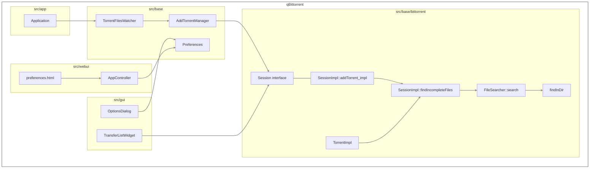
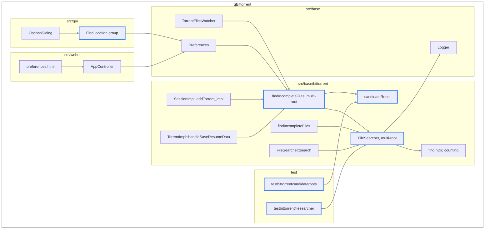
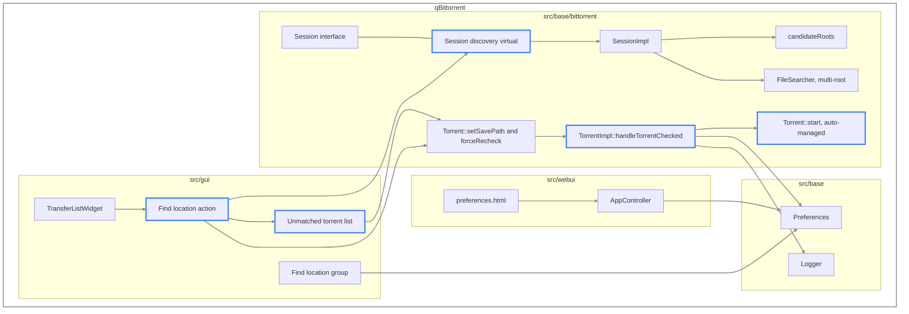
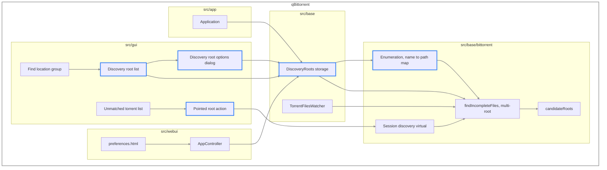

# Find Location — System Architecture

The systems this feature touches, and the shape of the repository after each submission. Behaviour is set out in [the feature specification](find-location_feature_spec.md), requirements in [the product requirements](find-location_product_requirements.md), implementation in [the technical approach](find-location_technical_approach.md), qualities in [the non-functional requirements](find-location_nfr.md), and build order in [the dependency map](find-location_dependency_map.md).

## Systems touched

| System | Location | Role |
| --- | --- | --- |
| Search | `src/base/bittorrent/filesearcher.*` | Probes a directory for a torrent's files, and constructs the candidate root list from the inputs its callers supply |
| Session implementation | `src/base/bittorrent/sessionimpl.*` | Composes the search root list, resolves a save path before a torrent reaches libtorrent, and marshals searching onto the I/O thread |
| Session interface | `src/base/bittorrent/session.h` | The abstraction `src/gui` and `src/webui` hold |
| Torrent | `src/base/bittorrent/torrentimpl.*` | Resolves for magnet links at metadata, and decides starting after a check |
| Settings | `src/base/preferences.*` | Holds the boolean settings |
| Discovery roots | `src/base/` | Holds the user's search roots and their per-root options |
| Watched folders | `src/base/torrentfileswatcher.*` | Supplies save paths to the search, and models per-root storage |
| Logging | `src/base/logger.h` | Records what discovery chose |
| Application | `src/app/application.cpp` | Owns the lifecycle of the discovery root singleton |
| Desktop interface | `src/gui/` | The options group, the transfer list action, and the dialogs |
| WebAPI | `src/webui/api/appcontroller.cpp`, `src/webui/webapplication.h` | Exposes the settings and versions the API |
| Web interface | `src/webui/www/private/views/preferences.html` | Presents the settings to a WebUI user |
| Build | `src/base/CMakeLists.txt`, `src/gui/CMakeLists.txt`, `test/CMakeLists.txt` | Registers every new source file |
| Tests | `test/`, `test/testdata/` | Covers the pure functions and the probe |

## Baseline

The resolution path before any of this work.

`FileSearcher` probes the torrent's save path, then its download path. `SessionImpl::addTorrent_impl` takes the result before libtorrent receives the torrent; `TorrentImpl` takes it when a magnet link's metadata arrives.

## Epic 1 — automatic discovery

**Added.** `candidateRoots()` beside `FileSearcher`. A multi-root search method, with `search()` delegating to it. A sibling to `findIncompleteFiles()` taking the root list. Two boolean settings. The options dialog group. The WebAPI keys and the WebUI controls that present them. Two test executables.

**Changed.** `findInDir()` returns a count. `addTorrent_impl` and `TorrentImpl` pass root lists rather than two paths.

**Unchanged.** Every signature outside `filesearcher.cpp` that a caller already depends on.

## Epic 2 — manual, batch and assignment

**Added.** A discovery virtual on the session interface with a completion signal. Three boolean settings. The start decision after a check. The transfer list action. The dialog listing torrents that matched nothing.

**Changed.** The options dialog group and the WebAPI gain the three settings, and the WebUI preferences page gains their controls.

**Unchanged.** Everything Epic 1 built below the session interface.

## Epic 3 — discovery roots

**Added.** Discovery root storage with per-root options, persisted as JSON. Enumeration producing a name-to-path map. The discovery root list in the options dialog and its per-root dialog. The pointed root action on the unmatched list. The singleton's lifecycle in `Application`.

**Changed.** The session search sibling reads the discovery root list and places those roots ahead of the watched folder save paths in the list it composes. `candidateRoots()` takes the enumerated map. The WebAPI and the WebUI preferences page gain the root list.

**Unchanged.** The probing, scoring and resolution built in Epic 1.

## Requirements trace

Specification behaviour against the architecture that carries it.

| Requirement | Carried by | Epic |
| --- | --- | --- |
| Place a torrent at content already on disk | `candidateRoots`, multi-root `FileSearcher`, `resolveFileNames` | 1 |
| Resolve before pieces are requested | `addTorrent_impl` ahead of libtorrent | 1 |
| Resolve for magnet links | `TorrentImpl::handleSaveResumeData` | 1 |
| Recover partial content | `findInDir` matching through `QB_EXT` | 1 |
| Any recoverable content is kept, at any proportion | `resolveFileNames`, `handleTorrentChecked` | 1, 2 |
| Probe by count, abandon early | `findInDir` counting variant | 1 |
| Select by count, order breaking ties | Multi-root `FileSearcher` | 1 |
| A miss goes to the configured destination | Multi-root `FileSearcher` | 1 |
| Enable and disable as a whole | Group gate preference, options group | 1 |
| Record what discovery chose | `Logger::addMessage` from the search | 1 |
| Settings reachable from the WebUI | `AppController`, `preferences.html` | 1, 2, 3 |
| Manual trigger, single and batch | Session discovery virtual, transfer list action | 2 |
| Torrents matching nothing are listed | Unmatched torrent list | 2 |
| Assignment rechecks and returns to service | `setSavePath`, `forceRecheck`, `handleTorrentChecked` | 2 |
| Assignment leaves content at the assigned location intact | `setSavePath` under the transfer list action | 2 |
| Seeding and downloading separately controlled | Three assignment preferences | 2 |
| Starting respects the queue | `Torrent::start` in auto-managed mode | 2 |
| Search directories the user configures | Discovery root storage, `candidateRoots` ordering | 3 |
| Recursive roots listed once and matched by name | Enumeration | 3 |
| Point the unmatched list at a directory | Pointed root action | 3 |
| A pointed root outranks every other search root | Session root composition | 3 |
| Repeatable across several disks | Pointed root action against the shrinking list | 3 |

## Build registration

Every new source file is registered where the repository already lists them: `src/base/CMakeLists.txt` for discovery root storage, `src/gui/CMakeLists.txt` for the unmatched list, the discovery root list and its options dialog, and `test/CMakeLists.txt` for both test executables.
