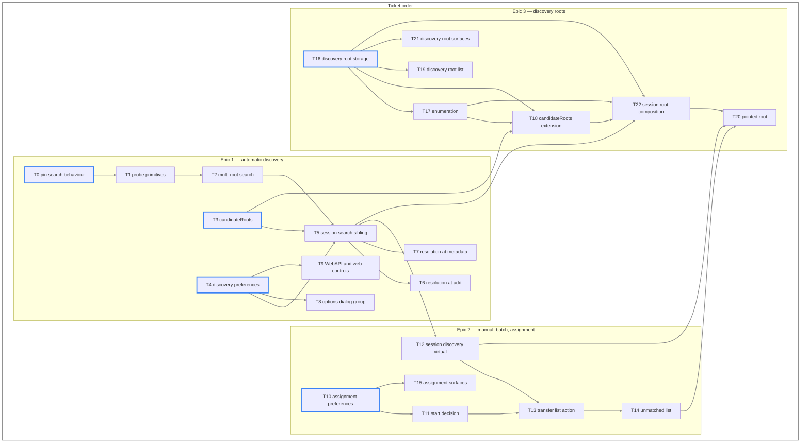

# Find Location — Technical Requirements

Verifiable statements the implementation is built to and reviewed against. Behaviour is set out in [the feature specification](find-location_feature_spec.md), product requirements in [the product requirements](find-location_product_requirements.md), implementation in [the technical approach](find-location_technical_approach.md), qualities in [the non-functional requirements](find-location_nfr.md), systems in [the system architecture](find-location_system_architecture.md), and build order and verification in [the dependency map](find-location_dependency_map.md).

Each requirement carries an identifier and the submission that delivers it: **E1** automatic discovery, **E2** manual, batch and assignment, **E3** discovery roots.

## Terms

* **Search root** — a directory supplied to `candidateRoots()` to be searched, distinct from the torrent's own save and download paths, which arrive as their own parameters. Its origins are the discovery root list, the watched folder save paths, and a pointed root. CR-2 places them all after the torrent's own paths; CR-3 fixes their order among themselves.
* **Candidate** — a directory actually probed, derived from a search root by CR-4 in the root form, the name form or the source form.
* **Destination** — where a miss places the torrent and where incomplete files are written. CR-7 fixes its derivation, and PS-7 and PS-11 turn on it.
* **Discovery root** — a search root the user configured, held with its own options.
* **Pointed root** — a search root the user chose for a single operation, held for no longer than that operation.

## Candidate root construction

* **CR-1** (E1) `candidateRoots()` shall take every input as a parameter and perform no singleton lookup of its own.
* **CR-2** (E1) The returned list shall be ordered: the torrent's save path, the torrent's download path, then the search roots in the order supplied.
* **CR-3** (E3) A pointed root shall be supplied ahead of every other search root. Discovery roots shall follow it, in the order the user configured them, ahead of the watched folder save paths.
* **CR-4** (E1) Each search root shall contribute three candidates in order: the **root form**, the root itself; the **name form**, the root joined with the torrent's name; the **source form**, the root joined with the basename of the `.torrent` file.
* **CR-5** (E1) An empty search root entry shall take the supplied default save path in its place.
* **CR-6** (E1) Duplicate candidates shall be collapsed, retaining the earliest occurrence and its position.
* **CR-7** (E1) The **destination** shall be the torrent's download path where one is set and its save path otherwise. It is where a miss places the torrent and where incomplete files are written. Any candidate may win a match; only the destination serves as the fallback.
* **CR-8** (E3) An enumerated root shall contribute the root form and the source form, the name form being served by a lookup against the enumeration map.
* **CR-9** (E1) The `SessionImpl` search sibling shall perform the lookups `candidateRoots()` does not — the watched folder set, the session default save path, and the settings gating them — and pass the composed list as `searchRoots`. Composition shall have one implementation, which every call site reaches.
* **CR-10** (E3) The same sibling shall read the discovery root list, place those roots ahead of the watched folder save paths within `searchRoots`, and supply the enumeration map for the roots marked recursive.

## Probing and selection

* **PS-1** (E1) A probe shall report the number of the torrent's declared files present beneath a candidate.
* **PS-2** (E1) A file shall count as present when it exists under its declared name, or under that name with `QB_EXT` appended.
* **PS-3** (E1) A probe shall read no file contents and compute no hashes.
* **PS-4** (E1) A probe shall abandon a candidate once its count can no longer exceed the highest count reached.
* **PS-5** (E1) Selection shall take the highest count, and the earliest candidate in order shall take a tie.
* **PS-6** (E1) A candidate whose count is zero shall not be a match.
* **PS-7** (E1) Where no candidate matches, the result shall be the destination.
* **PS-8** (E1) The returned file names shall be those the winning candidate produced.
* **PS-9** (E1) Scoring shall leave the supplied file name list unmodified.
* **PS-10** (E1) No completion threshold shall be applied. A torrent whose check reports any recoverable content shall keep the location discovery selected, at whatever proportion the check reports.
* **PS-11** (E1) `forceAppendExt` shall be applied to the destination alone, never to a root that is only searched.
* **PS-12** (E1, E3) A search root that cannot be read shall yield a count of zero, and an enumerated one an empty map. Neither shall fail the operation or displace another root's result.

## Enumeration

* **EN-1** (E3) A discovery root shall carry a recursion flag.
* **EN-2** (E3) A root whose flag is set shall have its immediate subdirectories listed once for the operation that needs it.
* **EN-3** (E3) The listing shall be a map from subdirectory name to path.
* **EN-4** (E3) Map keys and lookups shall be folded to a single case where `Path::CASE_SENSITIVITY` is `Qt::CaseInsensitive`, so a lookup resolves what `exists()` resolves on that platform.
* **EN-5** (E3) The map shall be keyed on a folded name. `Path` is unsuitable as a key, its equality honouring `Path::CASE_SENSITIVITY` while its hash does not.
* **EN-6** (E3) The map shall be discarded when the operation that built it ends.
* **EN-7** (E3) A pointed root shall be enumerated on the same terms as a recursive discovery root.

## Resolution

* **RL-1** (E1) The save path shall be resolved before the torrent is submitted to libtorrent.
* **RL-2** (E1) A torrent lacking metadata at add shall be resolved when metadata is received, before content pieces are requested.
* **RL-3** (E1) Resolution shall run on the session I/O thread.
* **RL-4** (E1) Resolution shall not block its caller.
* **RL-5** (E1) No filesystem access shall occur on the GUI thread.
* **RL-6** (E1) Discovery shall create, move, rename and delete nothing.

## Assignment

* **AS-1** (E2) Assignment shall disable automatic management before setting the save path.
* **AS-2** (E2) Assignment shall force a recheck while **Recheck automatically** is enabled.
* **AS-3** (E2) Assignment shall not overwrite content at the assigned location with data from the torrent's previous save path.
* **AS-4** (E2) The decision to start shall be taken when the check reports, not when the location is assigned.
* **AS-5** (E2) A torrent whose check reports complete content shall start while **Seed automatically** is enabled.
* **AS-6** (E2) A torrent whose check reports incomplete content shall start while **Leech automatically** is enabled.
* **AS-7** (E2) Starting shall use `TorrentOperatingMode::AutoManaged`, leaving the session's queueing limits governing.
* **AS-8** (E2) Torrents awaiting a start decision shall be tracked by info hash, so a check the user triggered by other means is unaffected.

## Settings and persistence

* **ST-1** (E1, E2) Each boolean setting shall be a getter and setter pair on `Preferences`, defaulting to enabled, writing only on a changed value.
* **ST-2** (E1) The options group's state shall be a preference of its own, gating the feature ahead of the individual settings.
* **ST-3** (E1) Disabling the group shall leave the settings within it holding their stored values.
* **ST-4** (E1) With the group disabled, the candidate list shall hold the torrent's save path and download path alone.
* **ST-5** (E3) Discovery roots shall persist as a JSON object per root, with the recursion flag a key within it.
* **ST-6** (E3) The discovery root list shall be empty by default.
* **ST-7** (E3) Discovery root storage shall be a singleton whose lifetime `Application` owns.
* **ST-8** (E3) A pointed root shall not be written to the discovery root list. It applies to the operation that chose it and to no other, and leaves the user's configuration as they set it.

## Interfaces

* **IF-1** (E1) The options dialog group shall be a checkable group box titled **Find location**, placed among the download options.
* **IF-2** (E2) **Seed automatically** and **Leech automatically** shall be enabled only while **Recheck automatically** is checked.
* **IF-3** (E3) The discovery root list shall offer a per-root dialog carrying the recursion flag.
* **IF-4** (E1, E2, E3) Every setting shall be exposed on `app/preferences` and `app/setPreferences`.
* **IF-5** (E1, E2, E3) Every setting shall have a control on the web interface preferences page.
* **IF-6** (E1, E2, E3) Each submission shall bump `API_VERSION` and add a `WebAPI_Changelog.md` entry naming the keys it introduces.
* **IF-7** (E2) A **Find location** action shall appear in the transfer list context menu beside **Set location...**, over single and multiple selections.
* **IF-8** (E2) Where discovery finds no match, the **Set location** dialog shall open.
* **IF-9** (E2) Torrents in a batch that matched nothing shall be presented as a list the user can walk or abandon.
* **IF-10** (E3) The unmatched list shall accept a directory to search, and shall accept another while entries remain.
* **IF-11** (E2) The GUI shall reach discovery through the `BitTorrent::Session` interface.
* **IF-13** (E2) The session discovery virtual shall be a `void` operation reporting through a completion signal carrying one torrent's result, so a batch receives each outcome as that torrent completes rather than one result for the selection.
* **IF-12** (E1, E2, E3) Every user-facing string shall be translatable through `tr()`.

## Logging

* **LG-1** (E1) A search shall record the torrent, the winning candidate, the origin it came from, and the count that chose it, through `Logger::addMessage`.
* **LG-2** (E1) A search matching nothing shall record that outcome.
* **LG-3** (E1) Log volume shall stay proportional to torrents processed rather than to candidates probed.

## Build and verification

* **BT-1** (E3) New `src/base` sources shall be registered in `src/base/CMakeLists.txt`.
* **BT-2** (E2, E3) New `src/gui` sources shall be registered in `src/gui/CMakeLists.txt`.
* **BT-3** (E1) Test executables shall be registered in `testFiles` in `test/CMakeLists.txt`.
* **BT-4** (E1) The two-directory behaviour of `FileSearcher::search()` shall be pinned by a test written before that code changes.
* **BT-5** (E1, E3) Candidate root construction, selection, and the enumerated name lookup shall be covered without a populated filesystem.
* **BT-6** (E1, E3) Probing and enumeration shall be covered against fixtures under `test/testdata/`.
* **BT-7** (E1, E2, E3) The suite shall pass under `-DTESTING=ON` on Ubuntu, macOS and Windows.

The step-by-step verification plan is set out in [the dependency map](find-location_dependency_map.md).

## Constraints

* **CN-1** (E1) `FileSearcher::search()` shall keep its signature.
* **CN-2** (E1) `SessionImpl::findIncompleteFiles()` shall keep its signature.
* **CN-3** (E1) The call site at `sessionimpl.cpp:3180` shall be left unmodified.
* **CN-4** (E1) The derivation of the torrent's own save path in `addTorrent_impl` shall be left unmodified.
* **CN-5** (E1, E2, E3) Preferences, resume data and save paths written by earlier versions shall be read unchanged.
* **CN-6** (E1) Changes to `findInDir()` shall stay within its translation unit.
* **CN-7** (E1, E2, E3) No behaviour shall bypass the session's queueing or checking limits.

## Ticket order

Tickets are ordered from the ones depending on nothing to the ones depending on everything. Five tickets carry no prerequisite — T0, T3, T4, T10 and T16, outlined below — so work can begin at any of them and a selectable ticket exists at every point in the walk.

| Ticket | Delivers | Depends on |
| --- | --- | --- |
| T0 pin search behaviour | BT-3, BT-4 | — |
| T1 probe primitives | PS-1, PS-2, PS-3, PS-9, CN-6 | T0 |
| T2 multi-root search | PS-4, PS-5, PS-6, PS-7, PS-8, PS-11, PS-12, LG-1, LG-2, LG-3, BT-6, CN-1 | T1 |
| T3 candidateRoots | CR-1, CR-2, CR-4, CR-5, CR-6, CR-7, BT-3, BT-5 | — |
| T4 discovery preferences | ST-1, ST-2, ST-3 | — |
| T5 session search sibling | CR-9, ST-4, RL-3, RL-4, CN-2 | T2, T3, T4 |
| T6 resolution at add | PS-10, RL-1, RL-6, CN-3, CN-4 | T5 |
| T7 resolution at metadata | RL-2 | T5 |
| T8 options dialog group | IF-1 | T4 |
| T9 WebAPI and web controls | IF-4, IF-5, IF-6 | T4 |
| T10 assignment preferences | ST-1 | — |
| T11 start decision | AS-4, AS-5, AS-6, AS-7, AS-8, PS-10, CN-7 | T10 |
| T12 session discovery virtual | IF-11, IF-13 | T5 |
| T13 transfer list action | AS-1, AS-2, AS-3, IF-7, IF-8, BT-2 | T11, T12 |
| T14 unmatched list | IF-9, BT-2 | T13 |
| T15 assignment surfaces | IF-2, IF-4, IF-5, IF-6 | T10 |
| T16 discovery root storage | ST-5, ST-6, ST-7, BT-1 | — |
| T17 enumeration | EN-1, EN-2, EN-3, EN-4, EN-5, EN-6, PS-12, BT-6 | T16 |
| T18 candidateRoots extension | CR-8, BT-5 | T3, T16, T17 |
| T19 discovery root list | IF-3, BT-2 | T16 |
| T20 pointed root | EN-7, ST-8, IF-10 | T12, T14, T22 |
| T21 discovery root surfaces | IF-4, IF-5, IF-6 | T16 |
| T22 session root composition | CR-3, CR-10 | T5, T16, T17, T18 |

RL-5, IF-12, CN-5 and BT-7 hold across every ticket rather than belonging to one.
