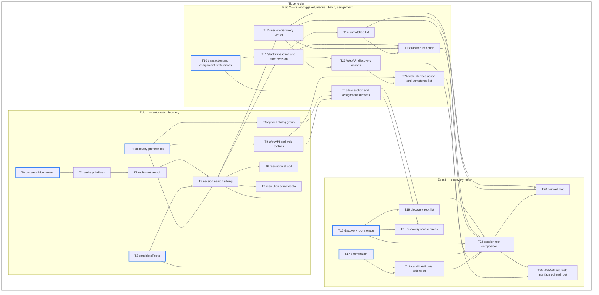

# Find Location — Technical Requirements

Verifiable statements the implementation is built to and reviewed against. Behaviour is set out in [the feature specification](find-location_feature_spec.md), product requirements in [the product requirements](find-location_product_requirements.md), implementation in [the technical approach](find-location_technical_approach.md), qualities in [the non-functional requirements](find-location_nfr.md), systems in [the system architecture](find-location_system_architecture.md), build order in [the dependency map](find-location_dependency_map.md), and files, tests and verification in [the workplan](find-location_workplan.md).

Each requirement carries an identifier and the submission that delivers it: **E1** automatic discovery, **E2** Start-triggered discovery, manual, batch and assignment, **E3** discovery roots.

## Terms

* **Own paths** — the torrent's save path and download path. They are probed and scored, and are never candidates.
* **Search root** — a directory supplied to `candidateRoots()` to be searched, distinct from the torrent's own paths, which arrive as their own parameters. Its origins are the discovery root list, the watched folder save paths, and a pointed root. CR-3 fixes their order among themselves; PS-5 fixes where their candidates are scored relative to the own paths.
* **Candidate** — a search-only directory, derived from a search root by CR-4 in the root form, the name form or the source form, or from an enumeration map by CR-8.
* **Destination** — where a miss places the torrent and where incomplete files are written. CR-7 fixes its derivation, and PS-7 and PS-11 turn on it.
* **Discovery root** — a search root the user configured, held with its own options.
* **Pointed root** — a search root the user chose for a single operation, held for no longer than that operation.
* **Operation** — one composition of search roots and their enumeration maps, shared by the searches EN-2 assigns to it.
* **Manual mode** — a torrent mode in which automatic torrent management does not own the torrent's placement.
* **Pending Start** — a normal or forced Start request intercepted before ordinary Start behaviour and held until its Start transaction permits or cancels it.
* **Start transaction** — the single feature-owned operation for one torrent from Start interception through match, miss, cancellation or failure.

## Candidate root construction

* **CR-1** (E1) `candidateRoots()` shall take every input as a parameter and perform no singleton lookup of its own.
* **CR-2** (E1) `candidateRoots()` shall return candidates alone, in the order of the search roots supplied, omitting any form equal to the torrent's save path or download path.
* **CR-3** (E3) A pointed root shall be supplied ahead of every other search root. Discovery roots shall follow it, in the order the user configured them, ahead of the watched folder save paths.
* **CR-4** (E1) Each search root shall contribute three candidates in order: the **root form**, the root itself; the **name form**, the root joined with the torrent's name, or with the file's stem for a single-file torrent without a root folder; the **source form**, the root joined with the `.torrent` file's name with its extension removed. The source form exists only when the descriptor's source is a local `.torrent` file; a magnet URI contributes none.
* **CR-5** (E1) An empty search root entry shall take the supplied default save path in its place.
* **CR-6** (E1) Duplicate candidates shall be collapsed by `Path` equality, retaining the earliest occurrence and its position, so duplicates fold case where `Path::CASE_SENSITIVITY` is `Qt::CaseInsensitive`.
* **CR-7** (E1) The **destination** shall be the torrent's download path where one is set and its save path otherwise. It is where a miss places the torrent and where incomplete files are written. Any scored directory may win a match; only the destination serves as the fallback.
* **CR-8** (E3) An enumerated root shall contribute the root form, then, for each directory its enumeration map holds under the torrent's name, and then for each directory it holds under the `.torrent` file's name with its extension removed, that directory's parent followed by the directory itself. It shall contribute no probed name form or source form. A lookup finding nothing contributes nothing, and a name CR-11 would drop is not looked up.
* **CR-9** (E1) `TorrentFilesWatcher` shall push the configured save path of every watched folder, ordered by watched folder path, into the session through `Session::setWatchedFolderSavePaths()`. The session shall resolve a relative entry against its default save path and compose `searchRoots` from the pushed list, the session default save path and the settings gating them. Composition shall have one implementation, `searchExistingContent()`, which every call site reaches.
* **CR-10** (E3) The same composition shall read the discovery root list, place those roots ahead of the watched folder save paths within `searchRoots`, and supply the enumeration map for the pointed root and for the roots marked recursive.
* **CR-11** (E1) A name form or source form whose name is empty, absolute, or begins with `.` or `..` shall be dropped, so no candidate resolves outside its root.

## Probing and selection

* **PS-1** (E1) A probe shall report the number of the torrent's declared files present beneath a directory.
* **PS-2** (E1) A file shall count as present when it exists under its declared name, or under that name with `QB_EXT` appended.
* **PS-3** (E1) A probe shall read no file contents and compute no hashes.
* **PS-4** (E1) A directory that does not exist shall cost one existence test. A probe shall abandon a directory once its count can no longer exceed the highest count reached, and scoring shall stop once a directory holds every file.
* **PS-5** (E1) The torrent's save path, then its download path where one is set, then the candidates shall be scored in that order. Selection shall take the highest count, and the earlier directory shall take a tie, so the own paths win a tie and lose to any candidate holding more.
* **PS-6** (E1) A directory whose count is zero shall not be a match.
* **PS-7** (E1) Where no directory matches, the result shall be the destination, with the file names `FileSearcher::search()` produces for the same inputs.
* **PS-8** (E1) The returned file names shall be those the winning directory produced.
* **PS-9** (E1) Scoring shall leave the supplied file name list unmodified.
* **PS-10** (E1) No completion threshold shall be applied. A torrent whose check reports any recoverable content shall keep the location discovery selected, at whatever proportion the check reports.
* **PS-11** (E1) `forceAppendExt` shall be applied to the destination alone, never to a candidate.
* **PS-12** (E1, E3) A search root that cannot be read shall yield a count of zero, and an enumerated one an empty map. A directory beneath an enumerated root that cannot be read shall contribute no entry beneath it. None shall fail the operation or displace another root's result.

## Enumeration

* **EN-1** (E3) A discovery root shall carry a recursion flag.
* **EN-2** (E3) A root whose flag is set, and a pointed root, shall have every directory beneath it, at any depth, listed once per operation. Each `findTorrentLocations()` call and each **Search folder...** action is one operation; an automatic addition shares an add operation still in flight whose composed roots and default save path are unchanged, and otherwise forms its own.
* **EN-3** (E3) The listing shall be a map from subdirectory name to every listed directory bearing that name, ordered by `Path::data()`.
* **EN-4** (E3) Map keys and lookups shall be folded to a single case where `Path::CASE_SENSITIVITY` is `Qt::CaseInsensitive`, so a lookup resolves what `exists()` resolves on that platform.
* **EN-5** (E3) The map shall be keyed on a folded name. `Path` is unsuitable as a key, its equality honouring `Path::CASE_SENSITIVITY` while its hash does not.
* **EN-6** (E3) The map shall be discarded when the last search of the operation that built it ends. No session-lived filesystem cache is kept.
* **EN-7** (E3) A pointed root shall be enumerated on the same terms as a recursive discovery root.
* **EN-8** (E3) The listing shall neither list nor descend into a hidden directory, a symbolic link or a junction, so a link cannot return the walk to a directory already listed.

## Resolution

* **RL-1** (E1) The save path shall be resolved before the torrent is submitted to libtorrent.
* **RL-2** (E1) A torrent lacking metadata at add shall be resolved when metadata is received, before content pieces are requested.
* **RL-3** (E1) Resolution shall run on the session I/O thread.
* **RL-4** (E1) Resolution shall not block its caller.
* **RL-5** (E1) No filesystem access shall occur on the GUI thread.
* **RL-6** (E1) Discovery shall create, move, rename and delete nothing.
* **RL-7** (E1) At add and at metadata receipt, a manual-mode torrent whose winning directory is a candidate shall take that location as its save path with an empty download path, so no storage move follows its check. An automatic-mode torrent shall resolve through `findIncompleteFiles()`.

## Assignment

* **AS-1** (E2) Assignment shall disable automatic management before setting the save path.
* **AS-2** (E2) An assignment not owned by a pending Start shall force a recheck while **Recheck automatically** is enabled, once the assigned location is the torrent's actual storage location. An incomplete torrent whose storage remains in its download path receives no recheck.
* **AS-3** (E2) Assignment shall not overwrite content at the assigned location with data from the torrent's previous save path.
* **AS-4** (E2) For an assignment not owned by a pending Start, the decision to start shall be taken when the feature's check reports, not when the location is assigned.
* **AS-5** (E2) A torrent whose automatic assignment check reports complete content shall start while **Seed automatically** is enabled.
* **AS-6** (E2) A torrent whose automatic assignment check reports incomplete content shall start while **Leech automatically** is enabled.
* **AS-7** (E2) An automatic post-assignment start shall use `TorrentOperatingMode::AutoManaged`, leaving the session's queueing limits governing.
* **AS-8** (E2) Torrents awaiting an automatic post-assignment start decision shall be tracked by info hash and by the check the feature issued, so a check triggered by other means is unaffected.
* **AS-9** (E2) Manual assignment shall follow **Set location...** semantics: an incomplete torrent with a download path keeps its storage in that download path. A repeated assignment to the location already held shall coalesce into the active assignment; an assignment to a different location shall replace it.

## Start transactions

* **TX-1** (E2) While the feature gate and **Find location when starting stopped torrents** are enabled, a normal or forced Start request for a stopped manual-mode torrent that is not checking shall create its Start transaction before ordinary Start behaviour changes the torrent's stopped state or initiates payload activity. A torrent in automatic torrent management, a checking torrent, or a request made while either setting is disabled, shall follow ordinary Start behaviour without a transaction. A torrent is checking while libtorrent reports it checking files or resume data, which includes a stopped torrent never yet checked whose files are already on disk.
* **TX-2** (E2) From interception until TX-4 permits Start, the torrent shall remain held against creation, allocation or writing of payload files, requests for content pieces, and every other transition into payload download. A torrent without metadata may exchange metadata alone; metadata receipt shall continue the same transaction and shall not release its payload hold.
* **TX-3** (E2) For every match, phases shall occur in this order: discovery completes; a location outside the torrent's current save path and download path is assigned without overwriting it from the previous location; any required storage movement completes with the selected location reported as actual; the feature issues a recheck at the matched location; that exact recheck reports successful completion; the pending Start is released. A match at the current save path or download path skips assignment and movement but not recheck. The recheck is mandatory regardless of **Recheck automatically**, and no later phase shall begin before the preceding condition holds.
* **TX-4** (E2) A successful search with no match shall release the ordinary Start workflow at the configured destination. Every match shall release only after TX-3. Complete checked content shall seed, and partial checked content shall download only pieces the recheck found missing.
* **TX-5** (E2) A Start transaction shall preserve the user's requested normal or forced operating mode. Its eventual Start shall use that mode rather than the automatic post-assignment mode of AS-7.
* **TX-6** (E2) Repeated Start requests for a torrent with an active Start transaction shall coalesce into that transaction and shall create no additional search, assignment or recheck. The transaction shall retain the operating mode of the latest explicit Start request.
* **TX-7** (E2) A Stop request shall cancel an active Start transaction and leave the torrent stopped. Torrent removal and session shutdown shall cancel it without a later asynchronous result assigning, rechecking or starting the torrent.
* **TX-8** (E2) A discovery-operation, metadata-preparation, assignment, storage-movement or recheck failure shall be distinct from a successful miss: it shall clear all feature-owned state for the transaction, shall not release the pending Start, and shall leave the torrent stopped and able to begin a later transaction. A cached or reported checking state shall not satisfy TX-3; only successful completion of the feature-issued recheck shall do so.

## Settings and persistence

* **ST-1** (E1, E2) Each boolean setting shall be a BitTorrent session setting under a `FindLocation/` key, exposed as a getter and setter pair on `Session`, defaulting to enabled, writing only on a changed value.
* **ST-2** (E1) The options group's state shall be a setting of its own, `FindLocation/Enabled`, gating the feature ahead of the individual settings.
* **ST-3** (E1) Disabling the group shall leave the settings within it holding their stored values.
* **ST-4** (E1) With the group or **Find location automatically** disabled, add and metadata resolution shall go through `findIncompleteFiles()`, resolving by `FileSearcher::search()`'s two-directory behaviour and reading no watched folder save path or discovery root.
* **ST-5** (E3) Discovery roots shall persist in `discovery_roots.json` as a JSON array holding one object per root, carrying `path` and `recursive`. Loading shall drop an entry that is not an object, whose path is empty or relative, or whose path repeats an earlier entry.
* **ST-6** (E3) The discovery root list shall be empty by default.
* **ST-7** (E3) Discovery root storage shall be a singleton whose lifetime `Application` owns.
* **ST-8** (E3) A pointed root shall not be written to the discovery root list. It applies to the operation that chose it and to no other, and leaves the user's configuration as they set it.
* **ST-9** (E2) **Find location when starting stopped torrents** shall have a setting of its own, defaulting to enabled and gated by the feature group. It shall neither read nor write the value of **Find location automatically**, **Recheck automatically**, **Seed automatically** or **Leech automatically**.

## Interfaces

* **IF-1** (E1) The options dialog group shall be a checkable group box titled **Find location**, placed among the download options.
* **IF-2** (E2) **Seed automatically** and **Leech automatically** shall be enabled only while **Recheck automatically** is checked.
* **IF-3** (E3) The discovery root list shall offer a per-root dialog carrying the recursion flag.
* **IF-4** (E1, E2, E3) Every setting shall be exposed on `app/preferences` and `app/setPreferences`.
* **IF-5** (E1, E2, E3) Every setting shall have a control on the web interface preferences page.
* **IF-6** (E1, E2, E3) Each submission shall add one `WebAPI_Changelog.md` entry, under the version heading at the top of the file, naming the keys and actions it introduces and linking its pull request. `API_VERSION` and the version headings are set by the maintainers.
* **IF-7** (E2) A **Find location** action shall appear in the transfer list context menu directly after **Set location...**, over single and multiple selections, while the selection holds metadata and the feature group is enabled.
* **IF-8** (E2) Where discovery finds no match, the **Set location** dialog shall open.
* **IF-9** (E2) Torrents in a batch that matched nothing shall be presented as a list the user can walk or abandon.
* **IF-10** (E3) The unmatched list, in the desktop interface and in the web interface, shall accept a directory to search, and shall accept another while entries remain.
* **IF-11** (E2) The GUI and the WebAPI shall reach discovery and assignment through the `BitTorrent::Session` interface.
* **IF-12** (E1, E2, E3) Every user-facing string shall be translatable through `tr()`.
* **IF-13** (E2) The session discovery virtual shall be a `void` operation reporting through a completion signal carrying one torrent's result, so a batch receives each outcome as that torrent completes rather than one result for the selection.
* **IF-14** (E2) The options dialog group and WebUI preferences shall each offer a checkbox labelled **Find location when starting stopped torrents**, backed by the ST-9 setting.
* **IF-15** (E3) `Session::findTorrentLocations()` shall take a list of torrent IDs and an optional pointed root as one operation, reporting each torrent's result through the IF-13 completion signal. `findTorrentLocation()` shall keep its declaration and run as a one-torrent batch.
* **IF-16** (E3) `app/preferences` shall return each discovery root path in the native form it returns for `save_path` and the `scan_dirs` keys, while `discovery_roots.json` holds the `Path::data()` form.
* **IF-17** (E2) `torrents/findLocation`, accepted by POST alone, shall take an optional `hashes` as the other torrent actions take it. While the feature group is enabled it shall run discovery through `Session::findTorrentLocation()` for each named torrent holding metadata that is not already part of the web session's active operation, assign each match through `Session::assignTorrentLocation()` as its outcome arrives, and answer with the operation's pending, assigned and unmatched torrents: HTTP 202 while any torrent is pending, and HTTP 200 once none is, which ends the operation. A request without `hashes` shall register nothing and report the active operation, or empty lists with HTTP 200 where none is active. While the group is disabled it shall answer HTTP 409 and search nothing.
* **IF-18** (E2) `torrents/assignLocation`, accepted by POST alone, shall take `hashes` and `location` and assign the location to each named torrent through `Session::assignTorrentLocation()`. An empty location shall answer HTTP 400, and a location that is not an existing directory HTTP 409, creating nothing.
* **IF-19** (E2) The web interface shall offer **Find location** directly after **Set location...** in its transfer list context menu while the selection holds a torrent with metadata and `find_location_enabled` holds. One unmatched torrent shall open the **Set location** window assigning through `torrents/assignLocation`; several shall open a window listing them, assigning each entered location through the same action, and closing when abandoned or empty.
* **IF-20** (E3) `torrents/findLocation` shall take an optional `root`. With `root` present, the torrents a request registers shall be searched through one `Session::findTorrentLocations()` call carrying `root` as the pointed root; a `root` that is not an existing directory shall answer HTTP 409 and register nothing. `root` shall be written nowhere, and a request registering no torrent shall ignore it. The web interface unmatched list shall offer **Search folder...**, posting its listed torrents with the entered directory as `root`.

## Logging

* **LG-1** (E1) A search won by a candidate shall record the torrent, the winning location, the exact search root whose candidates contain it and that root's origin, and the count that chose it, through `Logger::addMessage`. A search won by an own path shall record nothing.
* **LG-2** (E1) A search whose candidates were probed and matched nothing shall record that outcome.
* **LG-3** (E1) Log volume shall stay proportional to torrents processed rather than to candidates probed.
* **LG-4** (E2) A Start transaction shall record one final outcome: continued after a match, continued after a miss, cancelled, or failed. A failure shall identify its phase and reported reason.

## Build and verification

* **BT-1** (E3) New `src/base` sources shall be registered in `src/base/CMakeLists.txt`.
* **BT-2** (E2, E3) New `src/gui` sources shall be registered in `src/gui/CMakeLists.txt`.
* **BT-3** (E1, E3) Test executables shall be registered in `testFiles` in `test/CMakeLists.txt`.
* **BT-4** (E1) The two-directory behaviour of `FileSearcher::search()` shall be pinned by a test written before that code changes.
* **BT-5** (E1, E3) Candidate root construction, the enumerated name lookup and the discovery root JSON conversion shall be covered without a populated filesystem.
* **BT-6** (E1, E3) Probing, selection and enumeration shall be covered against fixtures under `test/testdata/`.
* **BT-7** (E1, E2, E3) The suite shall pass under `-DTESTING=ON` on Ubuntu, macOS and Windows.
* **BT-8** (E2) Verification shall independently exercise TX-1 through TX-8, including normal and forced Start, metadata-only acquisition, a match at an own path, a match requiring assignment, a miss, repeated Start, Stop cancellation, removal and shutdown during an asynchronous phase, and one failure at each fallible phase.
* **BT-9** (E1, E2, E3) The WebUI `npm run lint` shall pass, `npm run format` shall leave the files unchanged, and `WebAPI_Changelog.md` shall pass `rumdl`.
* **BT-10** (E2) New web interface pages shall be registered in `src/webui/www/webui.qrc`, and new WebAPI actions accepting POST alone in `WebApplication::m_allowedMethod`.

The manual verification cases and integration scenarios are set out in [the workplan](find-location_workplan.md).

## Constraints

* **CN-1** (E1) `FileSearcher::search()` shall keep its signature.
* **CN-2** (E1) `SessionImpl::findIncompleteFiles()` shall keep its signature.
* **CN-3** (E1) The `m_fileSearcher->search()` call inside `SessionImpl::findIncompleteFiles()` shall be left unmodified.
* **CN-4** (E1) The derivation of the torrent's own save path in `addTorrent_impl` shall be left unmodified.
* **CN-5** (E1, E2, E3) Preferences, resume data and save paths written by earlier versions shall be read unchanged.
* **CN-6** (E1) `findInDir()` shall be left unmodified, and the helpers added beside it shall stay private to `filesearcher.cpp`.
* **CN-7** (E1, E2, E3) No behaviour shall bypass the session's queueing or checking limits.

## Ticket order

Tickets are ordered from the ones depending on nothing to the ones depending on everything. Six tickets carry no prerequisite — T0, T3, T4, T10, T16 and T17, outlined below — so work can begin at any of them and a selectable ticket exists at every point in the walk.

| Ticket | Delivers | Depends on |
| --- | --- | --- |
| T0 pin search behaviour | BT-3, BT-4 | — |
| T1 probe primitives | PS-1, PS-2, PS-3, PS-9, CN-6 | T0 |
| T2 multi-root search | CR-7, PS-4, PS-5, PS-6, PS-7, PS-8, PS-11, PS-12, BT-6, CN-1 | T1 |
| T3 candidateRoots | CR-1, CR-2, CR-4, CR-5, CR-6, CR-11, BT-3, BT-5 | — |
| T4 discovery preferences | ST-1, ST-2, ST-3 | — |
| T5 session search sibling | CR-9, ST-4, RL-3, RL-4, LG-1, LG-2, LG-3, CN-2 | T2, T3, T4 |
| T6 resolution at add | PS-10, RL-1, RL-6, RL-7, CN-3, CN-4 | T5 |
| T7 resolution at metadata | RL-2, RL-7 | T5 |
| T8 options dialog group | IF-1 | T4 |
| T9 WebAPI and web controls | IF-4, IF-5, IF-6 | T4 |
| T10 transaction and assignment preferences | ST-1, ST-9 | — |
| T11 Start transaction and start decision | TX-1, TX-2, TX-3, TX-4, TX-5, TX-6, TX-7, TX-8, AS-1, AS-2, AS-3, AS-4, AS-5, AS-6, AS-7, AS-8, AS-9, PS-10, LG-4, BT-8, CN-7 | T5, T10 |
| T12 session discovery virtual | IF-11, IF-13 | T5 |
| T13 transfer list action | IF-7, IF-8 | T11, T12, T14 |
| T14 unmatched list | IF-9, BT-2 | T11 |
| T15 transaction and assignment surfaces | IF-2, IF-4, IF-5, IF-6, IF-14 | T8, T9, T10 |
| T23 WebAPI discovery actions | IF-6, IF-11, IF-17, IF-18, BT-10 | T11, T12 |
| T24 web interface action and unmatched list | IF-19, BT-10 | T9, T23 |
| T16 discovery root storage | EN-1, ST-5, ST-6, ST-7, BT-1, BT-3, BT-5 | — |
| T17 enumeration | EN-2, EN-3, EN-4, EN-5, EN-8, PS-12, BT-6 | — |
| T18 candidateRoots extension | CR-8, BT-5 | T3, T17 |
| T19 discovery root list | IF-3, BT-2 | T15, T16 |
| T20 pointed root | EN-7, ST-8, IF-10 | T12, T14, T22 |
| T21 discovery root surfaces | IF-4, IF-5, IF-6, IF-16 | T15, T16 |
| T22 session root composition | CR-3, CR-10, EN-2, EN-6, EN-7, IF-15 | T5, T12, T13, T16, T17, T18, T23 |
| T25 WebAPI and web interface pointed root | IF-6, IF-10, IF-20, ST-8 | T22, T24 |

RL-5, IF-12, CN-5, BT-7 and BT-9 hold across every ticket rather than belonging to one.
